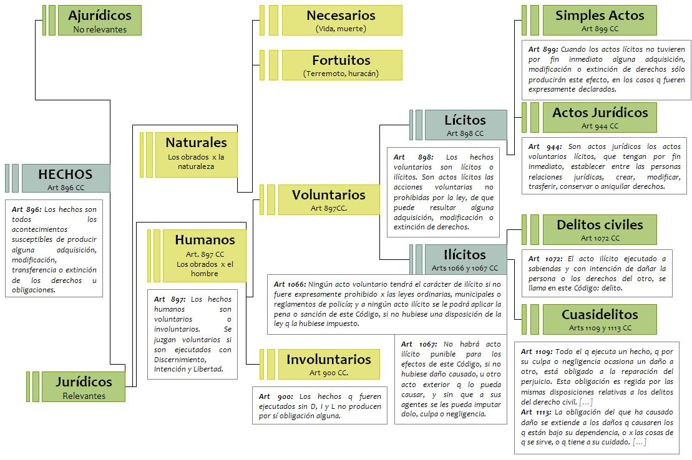

# Sujetos, Objetos, Hechos y Actos Jurídicos

## Sujeto del derecho
- **_Persona:_** Todos los entes susceptibles de adquirir derechos y contraer obligaciones.
- **_Persona humana:_** De características físicas, visible, de existencia real.
- **_Persona jurídica:_** De características posible, no visible, de existencia ideal.

### Atributos de una persona humana
- **Nombre**
- **Domicílio**
  - **_Real:_** donde vive o desempeña su actividad
  - **_Legal:_** donde vive a los efectos de la ley
  - **_Especial:_** elegido para cierto contrato (para que lleguen notificaciones al estudio por ejemplo)
- **Estado (civil)**
- **Capacidad**
  - **_Capacidad de ejercício:_** Puede ejercer derechos y obligaciones por si mismo
    - No natos
    - Menores de edad
    - Declarados incapaces por sentencia judicial.
  - **_Capacidad de derecho:_** Si es apto para ser titular de derechos y deberes jurídicos (limitable por la ley).

### Persona jurídica
- **_Pública:_** Estado/organismos/otros Estados/Iglesia Católica
- **_Privada:_** sociedades/asociaciones civiles/fundaciones/iglesias o religiones/cooperativas...

Los intereses de los administradores y la persona jurídica deben estar alineados.

Los administradores responden ilimitada y solidariamente frente a la persona jurídica, sus miembros y terceros.

#### Atributos de la persona jurídica (todo en el estatuto)
- Nombre
- Domicilio
- Patrimonio
- Fecha de creación y duración
- Objeto

Causales de disolución para después

## Objeto del derecho

- **Cosas**: Los objetos materiales susceptibles de tener valor económico, los aplicables a la energía, a las fuerzas naturales susceptibles de apropiación.
- **Bienes**: Los objetos inmateriales susceptibles de tener valor económico **+ cosas**.
- **Patrimonio**:El conjunto de bienes (derechos y obligaciones) susceptibles de apreciación pecuniaria.
  - Patrimonio = Bienes + Cosas - Deudas

### Tipos de cosas
- Movibles:
  - Muebles (objetos que se pueden mover)
  - Inmuebles (el piso)
  - Inmuebles por accesión (las cosas pegadas al piso).
- Carácter:
  - Materiales (físicas)
  - Inmateriales (intelectuales)
- Por su relación con las personas:
  - Bienes de dominio público del Estado. Son de todos (calles, plazas, el espacio aereo, la naturaleza).
  - Bienes de dominio privado del Estado. Son del estado (el edificio de fiuba, el edificio del congreso, aysa)
  - Bienes de dominio privado de los particulares. Son de una persona jurídica o humana.
- Divisibles o no
- Principales o accesorias
- Consumibles: dejan de existir al usarlas
- Fungibles: hechas en serie
- Frutos vs productos: los frutos se generan sustentablemente, los productos disminuyen la sustancia de la cosa que los origina.

## Hecho jurídico

> El hecho jurídico es el **acontecimiento** que, conforme al ordenamiento jurídico, **produce el nacimiento, modificación o extinción de relaciones o situaciones jurídicas**.

Los hechos pueden ser:
- Exteriores (los hace la naturaleza)
- Humanos (los hace alguien)
  - Involuntarios: sin discernimiento, intención o libertad
  - Voluntario: Con discernimiento, intención y libertad
    - Ilícito: prohibido por la ley
    - [Lícito](#actos-licitos): no prohibido por la ley
      - (Simple acto lícito): sin intención de ser jurídico. Por ejemplo, quien escribe una canción por placer no piensa, mientras lo hace, que el ordenamiento legal protege su creación intelectual y le asigna la paternidad de la obra. Los simples hechos lícitos se refieren a los actos voluntarios que no son contrarios al ordenamiento jurídico y que tampoco tienen por fin inmediato la producción de efectos sobre las situaciones y relaciones jurídicas. Esta última es la diferencia esencial entre simple acto lícito y el acto jurídico. En relación a estos últimos, las personas tienen por fin inmediato producir efectos en el mundo del derecho, mientras que en los simples actos lícitos es el derecho el que deriva los efectos del acto con prescindencia de la voluntad o del querer del sujeto, es decir, no se producen ex voluntate, sino ex lege. Los simples actos lícitos no eran específicamente tratados en el CC, pero la doctrina los consideraba como una categoría independiente. Se trata de una elaboración doctrinaria que los admitía en función del principio según el cual todo lo que no está prohibido se encuentra permitido (art. 19 CN). Se encuentran comprendidas aquí una serie de con- ductas que pueden ser o no intrascendentes para el derecho, pero que pueden derivar en la concreción de efectos jurídicos por prescripción legal. Así, por ejemplo, el derecho de pensar, caminar libremente, ejercer alguna facultad; también cabe incluir la apropia- ción de las cosas abandonadas (art. 1947, inc. a.i); la percepción de los frutos (art. 1928). Estos actos, aunque en sí mismos no sean jurídicamente significativos, pueden serlo si, por ejemplo, su ejercicio le es impedido al titular, de manera que provocan la reacción del ordenamiento jurídico, el cual podrá restablecer el derecho vulnerado y sancionar —si fuere el caso— al responsable.
      - **Acto jurídico:  El acto jurídico es el acto voluntario lícito que tiene por fin inmediato la adquisición, modificación o extinción de relaciones o situaciones jurídicas.**

### Voluntad
Un hecho jurídico humano es voluntario si tiene:
- **_Discernimiento:_** Es la facultad de distinguir lo bueno de lo malo.
- **_Intención:_** Se tiene el propósito de realizar un acto.
- **_Libertad:_** Ha habido ausencia de toda coacción física o moral.

Manifestación de la voluntad: oralmente/por escrito/signos inequívocos/ejecucion/tácita (obvia, no expresa)

### Acto jurídico
- **Clasificación**:
  - Positivos o negativos:_** si hace falta realizarlo u omitirlo para que se modificquen situaciones juridicas.
  - Unilaterales o bilaterales:_** Si hace falta 1 o 2 personas para hacerlo.
  - Actos entre vivos y de última voluntad:_** según si la eficacia depende del fallecimiento de aquellos cuya voluntad emanan.
- **Elementos**:
  - **_Sujeto:_** debe ser capaz y tener voluntad
  - **_Objeto:_** El objeto del acto jurídico no debe ser un hecho imposible o prohibido por la ley, contrario a la moral, a las buenas costumbres, al orden público o lesivo de los derechos ajenos o de la dignidad humana. Tampoco puede ser un bien que por un motivo especial se haya prohibido que lo sea. 
  - **_Causa:_** fin inmediato determinante de la voluntad. Existe aunque no esté expresada.
  - ​ Forma​ : la forma es un conjunto de prescripciones de la ley, respecto de las solemnidades que deben observarse al tiempo de la formación del acto jurídico, como la escritura del acto, la presencia de testigos, que el acto sea hecho por escribano público o por un oficial público, o con el concurso del juez del lugar.
    - a.​ ​ Formales: deben cumplir las formas mencionadas.
    - b.​ ​ No formales: si no se designa en en el CC una forma para el acto jurídico en cuestión, el mismo es no formal.
- **Instrumento**: Son documentos que registran el otorgamiento de actos jurídicos.
  - **Instrumentos públicos**: requieren intervención de oficial público
  - **Instrumentos privados**: no lo requieren.
  - **_Testamento:_** Un testamento ológrafo debe ser escrito todo entero, fechado y firmado por la mano misma del testador. Si falta alguna de las formalidades, es totalmente nulo.
  - Bajo forma privada, un acto requiere la firma de las partes, sin reemplazo por signos, iniciales o nombres ni apellidos. Debe ir al pie del documento.
  -  Los actos que contengan convenciones perfectamente bilaterales deben ser redactados en tantos originales como partes haya con un interés distinto.

#### Vicios de la voluntad
Causan nulidad del acto

- **Error**: falsa noción de una cosa.
  > Se entiende por “error” el falso conocimiento de la realidad de las cosas. Es un vicio de la voluntad que afecta la intención del sujeto, como elemento interno del acto voluntario; de no haber tenido un falso conocimiento de las cosas, la persona jamás hubiera cele- brado el acto.
  - **_De hecho:_** aplicar mal la norma. Segel CCyC comentado:
    > Puede recaer sobre algún elemento de hecho, contenido o presupuesto del acto; en tal caso se tratará de error de hecho.
  - **_De derecho:_** haber equivocado el concepto sobre la naturaleza jurídica de la norma.
  - Causa nulidad cuando es de hecho, escencial y reconocible por el destinatario
- **Dolo**: Intención de delinquir. Mentir (Aserción de lo falso o simulación de lo verdadero) u ocultar. Puede ser por acción u omisión. Es esencial y causa la nulidad del acto si:
  - Es grave
    > No cualquier acción dolosa es suficiente para decretar la nulidad de un acto. El ardid, as- tucia o maquinación deben ser idóneos para provocar engaño, porque este constituye la esencia del dolo. No hay dolo cuando el artificio o engaño es menor, una simple picardía, exageración o avivada que cualquiera podría advertir sin ningún esfuerzo extra. El límite de tolerancia radica en la buena fe y en la entidad del engaño para inducir al otro. La gravedad del dolo, esto es, la idoneidad del engaño, debe ser apreciada según las características y condiciones de la víctima. Un ardid que no podría llevar a engaño a una persona sagaz y culta tal vez sea suficiente para inducir a un analfabeto o una persona de pocas luces a celebrar el negocio. Las mismas consideraciones son de aplicación a la omisión dolosa cuando se trata de apreciar su gravedad.
  - es determinante para la voluntad
    > El engaño debe estar encaminado a lograr que otro realice un determinado acto jurídico. El dolo es causa determinante del acto cuando la maniobra elaborada por el autor afecta el proceso deliberativo interno de la otra persona y vicia la intención; de no haber sido por esa conducta que le presentó a la víctima un estado de las cosas falso o irreal, el acto no se hubiera llevado a cabo. Si no obstante el engaño, la víctima hubiere igualmente celebrado el negocio jurídico, no podrá reclamarse la nulidad porque el dolo habría sido incidental o irrelevante.
  - causa daño importante
    > Para que pueda acarrear la nulidad del acto, el CCyC exige que el daño causado por la acción dolosa sea importante. Vale decir, la víctima tiene que haber experimentado un perjuicio de cierta magnitud. Este requisito ha sido controvertido por algunos autores, pero el CCyC —al igual que el Código Civil de Vélez, que siguió la postura de Chardón — lo mantiene y guarda relación con el principio de conservación del acto jurídico, al que expresamente y en diferentes disposiciones se hace referencia. De modo que para declarar su ineficacia es preciso que se configuren razones de envergadura tal que justifique apartarse de dicho postulado que tiende a la estabilidad de los negocios y a la seguridad jurídica. En caso de que el dolo no hubiere provocado un daño significativo, la víctima siempre podrá reclamar la reparación de los daños y perjuicios sin necesidad de invalidar el acto jurídico, toda vez que la ilicitud de la conducta siempre se mantiene. El daño que provoca la nulidad puede ser patrimonial o moral. En ambos casos, la importancia del perjuicio debe ser ponderada tomando en consideración la trascendencia o entidad del negocio afectado, con prescindencia del monto económico comprometido.
  - no hubo dolo por ambas partes
    > Es una exigencia del principio de la buena fe. Dice Borda: “quien juega sucio, no tiene derecho a exigir un juego limpio. Si las partes se han engañado mutuamente, la ley se desinteresa de ellas; es bueno que sufran perjuicio de su propia inconducta”.
- **Fuerza e intimidacion/Violencia**: Amenazas, violencia física o moral, causan nulidad según la relevancia.

#### Vicios de los actos jurídicos
- **Lesión**: Puede demandarse la [nulidad](#nulidad) o la modificación de los actos jurídicos cuando una de las partes explotando la necesidad, debilidad síquica o inexperiencia de la otra, obtuviera por medio de ellos una ventaja patrimonial evidentemente desproporcionada y sin justificación. 
  - Se puede exigir [nulidad](#nulidad) o reajuste
  - Sólo el lesionado o sus herederos pueden ejercer la acción
- **Simulación**:  se encubre el carácter jurídico de un acto bajo la apariencia de otro.
  - **_Ilícita:_** perjudica a un tercero
  - **_Lícita:_** El acto simulado encubre otro real si no es ilícito ni perjudica a terceros.
  - **_Absoluta_** (el acto jurídico no es totalmente real) vs Relativa (se da apariencia de otro acto jurídico)
- **Fraude**: se establecen condiciones para que el acreedor pueda solicitar revocación:
  - Deudor insolvente
  - El acto del deudor es perjuicio para los acreedores
  - El crédito en virtud del cual se intenta accionar es de fecha anterior al acto del deudor

#### Nulidad
Es la sanción legal que priva de sus [efectos](#efecto) normales a un acto jurídico. La nulidad puede ser absoluta si la misma se realiza de oficio, es una decisión judicial que no requiere [confirmación](#confirmacion-del-acto-juridico) alguna. En cambio si la nulidad no puede ser declarada de oficio por el juez y solo puede solicitarla el beneficiario, la nulidad es relativa.

##### Efecto
Se vuelven las cosas al estado en que se encontraban antes del acto anulado. Existe derecho por parte de los damnificados de reclamar indemnización por daños y perjuicios.

##### Confirmación del acto jurídico
Es cuando un acto jurídico viciado puede ser confirmado y tener validez. Esta confirmación aplica a los actos jurídicos anulables y de nulidad relativa pero no a los nulos.

### Actos ilícitos
No permitido por la ley
- **Delito**:Todo acto ilícito realizado **con dolo** que **produce daño**
- **Cuasidelito**: Todo acto ilícito realizado **sin dolo** que **produce daño**
- **Delito civil**: Delito **privado**, penado **patrimonialmente**, fallo por **analogía**.
- **Delito penal**: Delito **público**, penado con **privacion de la libertad**, fallo **estrictamente** de acuerdo a la ley.
