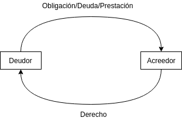

# Obligaciones
> La obligación es una relación jurídica en virtud de la cual el acreedor tiene el derecho a exigir del deudor una prestación destinada a satisfacer un interés lícito y, ante el incumplimiento, a obtener forzadamente la satisfacción de dicho interés.

## Elementos
- **Prestación/Objeto**: Lo que el **deudor** le da al **acreedor**.
- **Sujetos**: acreedor/activo, deudor/pasivo.
- **Fuentes**: 
  - Tradicionales
    - Contrato (varias personas se ponen de acuerdo sobre una declaración de voluntad común destinada a reglar sus derechos)
    - Cuasicontrato (contrato sin consentimiento de una de las partes)
      > hechos voluntarios y lícitos que obligan a las partes sin que haya existido previamente un acuerdo de voluntades. Ej.:
      > - El cobro de lo indebido: cuando una persona paga, por error, a otra, la Ley obliga a que el receptor de esos fondos debe restituirlos de forma inmediata.
    - Delitos
    - Cuasidelitos
    - La Ley (sentencia o fallo es su aplicación)
  - Modernas
    - Abuso de derecho
    - Enriquecimiento sin causa
    - Voluntad unilateral: una parte se obliga sin intervención o requerimiento de la otra. (Ejemplo: billetes al portador, concurso de belleza con premio, recompensa por búsqueda de un perro perdido).

## Requisitos:
- debe ser material y jurídicamente posible
- lícita, determinada o determinable
- susceptible de valoración económica
- debe corresponder a un interés patrimonial o extrapatrimonial del acreedor.

## Efectos de las obligaciones con relación al acreedor
La obligación da derecho al acreedor a:
- emplear los medios legales para que el deudor le procure aquello a que se ha obligado
- hacérselo procurar por otro a costa del deudor
- obtener del deudor las indemnizaciones correspondientes

## Tipos de obligaciones
- **_De dar_**
  > El deudor de una cosa cierta está obligado a conservarla en el mismo estado en que se encontraba cuando contrajo la obligación, y entregarla con sus accesorios, aunque hayan sido momentáneamente separados de ella.
- **_De hacer o no hacer_**
  > La **obligación de hacer** es aquella cuyo objeto consiste en la prestación de un servicio o en la realización de un hecho, en el tiempo, lugar y modo acordados por las partes.
  > 
  > **Obligación de no hacer**. Es aquella que tiene por objeto una abstención del deudor o tolerar una actividad ajena. Su incumplimiento imputable permite reclamar la destrucción física de lo hecho, y los daños y perjuicios.
- **_Alternativas_**:
  > La obligación alternativa tiene por objeto una prestación entre varias que son independientes y distintas entre sí. _El deudor está obligado a cumplir una sola de ellas_.
- **_Facultativas_**:
  > La obligación facultativa tiene una prestación principal y otra accesoria. El acreedor solo puede exigir la principal, pero el deudor puede liberarse cumpliendo la accesoria. El deudor dispone hasta el momento del pago para ejercitar la facultad de optar.
- **_Cláusula penal_**:
  > Aquella por la cual una persona, para asegurar el cumplimiento de una obligación, se sujeta a una pena o multa en caso de retardar o de no ejecutar la obligación.
- **_Divisibles e Indivisibles_**:
  > Obligación divisible es la que tiene por objeto prestaciones susceptibles de cumplimiento parcial.
  > 
  > Son indivisibles las obligaciones no susceptibles de cumplimiento parcial.
- **_De sujeto plural_**:
  - simplemente mancomunadas
    > La obligación simplemente mancomunada es aquella en la que el crédito o la deuda se fracciona en tantas relaciones particulares independientes entre sí como acreedores o deudores haya. Las cuotas respectivas se consideran deudas o créditos distintos los unos de los otros.
  - solidarias
    > Hay solidaridad en las obligaciones con pluralidad de sujetos y originadas en una causa única cuando, en razón del título constitutivo o de la ley, su cumplimiento total puede exigirse a cualquiera de los deudores, por cualquiera de los acreedores.
- **_Concurrentes_**:
  > Obligaciones concurrentes son aquellas en las que varios deudores deben el mismo objeto en razón de causas diferentes.
- **_Disyuntivas_**:
  > Si la obligación debe ser cumplida por uno de varios sujetos, excepto estipulación en contrario, el acreedor elige cuál de ellos debe realizar el pago. Mientras el acreedor no demande a uno de los sujetos, cualquiera de ellos tiene derecho de pagar. El que paga no tiene derecho de exigir contribución o reembolso de los otros sujetos obligados.
- Principales vs. accesorias: Las accesorias son contraídas para asegurar el cumplimiento de la principal. La principal es la razón de la existencia de las accesorias.
  > Obligaciones **principales** son aquellas cuya existencia, régimen jurídico, eficacia y desarrollo funcional son autónomos e independientes de cualquier otro vínculo obligacional.
  > 
  > Los derechos y obligaciones son **accesorios** a una obligación principal cuando dependen de ella en cualquiera de los aspectos precedentemente indicados, o cuando resultan esenciales para satisfacer el interés del acreedor.

## Extinción de las obligaciones

- Medios que satisfacen al acreedor:
  - **Pago**: cumplimiento de la prestación.
  - **Compensación**: se compensan las deudas del acreedor y el deudor porque hay otra/s deuda/s.
  - **Confusión**: Acreedor y deudor pasan a ser la misma persona.
  - **Novación**: La obligación es reemplazada o renovada.
  - **Dación en pago**: El acreedor acepta una cosa distinta a la acordada.
- Medios que no satisfacen al acreedor:
  - **Renuncia o remisión de deuda**: El acreedor decide renunciar a la prestación.
  - **Imposibilidad de pago**: pasa a ser imposible el pago. Generalmente se convierte en una de pagar una indemnización (ej.: rompí el jarrón que te iba a dar).
  - **Prescripción liberatoria**: luego de un plazo fijado por la ley desde el último reclamo, la deuda desaparece.

En caso de fallecimiento las obligaciones se heredan, a menos que solo la persona muerta sea capaz de cumplir la obligación.

# Imputabilidad
Las normas legales hacen cargo al autor de los actos, de la responsabilidad derivada de estos.
Existen tres causas:
- **Dolo**: intención de engañar, de dañar, etc.
- **Culpa**: omisión de aquellas diligencias que exigiere la naturaleza de la obligación y que correspondiesen a las circunstancias de las personas, del tiempo y del lugar. Es subjetivo. Si no es culpa objetiva, la prueba corresponde al acreedor. Si es culpa objetiva, rige el principio de inversión de prueba, se presume dicha culpa. Habrá que producir pruebas en contrario por parte del deudor.
- **Mora**: en obligaciones a plazo, la mora se produce por su solo vencimiento. Si no hay plazo fijado, se podrá extraer de la naturaleza de la obligación. Puede requerir intervención del juez. 
  
Es importante también mencionar el daño. Este es derivado en casi todos los casos, del incumplimiento. Los elementos del daño son:
- **Daño emergente**: daño o deterioro patrimonial efectivamente sufrido
- **Lucro cesante**: aquello que pudiendo constituir un beneficio, ha dejado de percibirse como consecuencia. Es lo referente al daño material.

Existen dos causales que no generan imputabilidad:
- **Caso fortuito**: hecho de la  naturaleza que no pudo preverse o que previsto no pudo evitarse. Ejemplo: Inundación o terremoto.
- **Fuerza mayor**: hecho del “soberano” que impide el cumplimiento de la obligación. Ejemplo: Declaración de una guerra.

# Contratos

## Definición
Hay contrato cuando varias personas se ponen de acuerdo sobre una declaración de voluntad común, destinada a reglar sus derechos.
## Elementos de un contrato
1. Esenciales: aquellos que resultan indispensables para la formación de todo contrato.
  - **_Capacidad_**: es la facultad de adquirir derechos y contraer obligaciones. Puede ser de hecho o de derecho.
  - **_Consentimiento_**: es necesario que las partes contratantes coincidan en el fin y el contenido del acto a realizar y manifiesten su voluntad de adhesión al proyecto mediante alguno de los medios provistos por la ley. El consentimiento debe darse sobre todos los puntos del contrato. Aceptada la propuesta, cualquier modificación implica la gestión de un nuevo contrato. No necesariamente es explícito. La exteriorización puede no ser simultánea. El momento en el cual se produce la exteriorización dio lugar a varias teorías:
    - **_de la declaración_**: la sola declaración de una de las partes es suficiente.
    - **_de la información_**: ambas partes están informadas de la aceptación de la otra.
    - **_de la emisión_**: se perfecciona el contrato desde que se manda la aceptación.
    - **_de la recepción_**: el aceptante puede retractarse hasta que la aceptación llegue a poder del proponente.
  - **_Objeto_**: debe ser lícito y de apreciación pecuniaria.
  - **_Causa_**: puede confundirse con el objeto. Se considera causa, la causa final o finalidad del contrato.
  - **_Forma_**: es requisito esencial para cierto tipo de contratos. Son los recaudos que la ley exige para darle validez o para poder probar la expresión de la voluntad de las partes. También se incluyen en esta categoría aquellas condiciones particulares de cada tipo de contrato (como el precio en el contrato de obra pública).
2. Naturales: son considerados implícitos por la ley.
3. Accidentales: aquellos establecidos mediante declaración expresa, sin opción de la ley.

## Clasificación de los contratos
1. **_Unilaterales o bilaterales_** (Art. 966 CCyC): según si una sola de las partes se obliga hacia la otra sin que esta le quede obligada (existencia o no de obligación recíproca).
   > - Son contratos **_unilaterales_** los que, en el momento de su celebración, solo generan obligaciones a cargo de una de las partes intervinientes.
   >  _Ejemplos_: la donación (art. 1542 CCyC), el mandato gratuito (arts. 1319 y
1322 CCyC), la fianza (art. 1574 CCyC), el depósito gratuito (art. 1356 CCyC), el mutuo
gratuito (art. 1525 CCyC) y el comodato (art. 1533 CCyC).
   > - Son **_bilaterales_** o con prestaciones recíprocas, los contratos que —desde su celebración— generan obligaciones recíprocas para todas las partes intervinientes. Se trata de obligaciones que surgen al mismo tiempo y se encuentran interrelacionadas, de modo que la causa de la obligación de una de las partes es la consideración de una contraprestación a cargo de la otra. Tal circunstancia es relevante porque una de las obligaciones no puede válidamente concebirse sin la otra; cada parte no está obligada a la prestación a su cargo sin que sea debida la prestación de la otra. No se requiere equivalencia objetiva entre las prestaciones.
   >  _Ejemplos_: la compraventa (art. 1123 CCyC), la permuta (art. 1171 CCyC), el suministro (art. 1176 CCyC), la locación (art. 1187 CCyC), el leasing (art. 1227 CCyC), el contrato de obra o de servicios (art. 1251 CCyC), el transporte (art. 1280 CCyC) y el de consignación (art. 1335 CCyC), entre otros.
   > 
   > _(fuente: CCyC comentado)_
2. **_Onerosos o gratuitos_** (Art. 967 CCyC): es oneroso cuando ambas partes se aseguren una prestación y gratuito si asigna ventajas a una sola de las partes.
   > La mayor parte de los contratos que se celebran a diario son onerosos. El contrato es oneroso si impone sacrificios y ventajas recíprocas, y es gratuito cuando establece sacrificio para uno y ventaja para otro.
   > 
   > El factor determinante será el interés. Pues, si solo una de las partes lo tiene al celebrar el contrato, ese vínculo negocial deberá ser clasificado como gratuito; y si lo tienen todas, como oneroso. Son onerosos los contratos bilaterales, pero también pueden serlo otros, como la donación remuneratoria, de carácter unilateral.
3. **_Conmutativos o aleatorios_** (Art. 968 CCyC): según si la prestación que cada una de las partes recibe, depende o no de un hecho futuro e incierto.
   > Dentro de la categoría de los contratos a título oneroso, es posible diferenciar los contratos **conmutativos**, aquellos en los que las obligaciones a cargo de cada una de las partes pueden ser determinadas con cierto grado de certeza cualitativa y cuantitativa al tiempo de la celebración, de los **aleatorios**, que son aquellos en los que las pérdidas o las ventajas para una o para todas las partes involucradas, dependen de un acontecimiento futuro e incierto.
   >
   > El contrato podrá ser clasificado como conmutativo cuando el cumplimiento de las obligaciones a cargo de cada una de las partes se encuentre determinado desde la celebración y aleatorio cuando ello se encuentre sujeto a un acontecimiento futuro, ajeno a la voluntad de las partes, como el tiempo de vida de las personas designadas en el contrato oneroso de renta vitalicia (arts. 1599, 1606 CCyC y cc.) o que efectivamente ocurra un siniestro ajustado al riesgo previsto en un contrato de seguro (arts. 70, 105, 114, 152 CCyC de la ley 17.418).
4. **_Formales o no_** formales (Art. 969 CCyC): es para contratos consensuales. Según si dependan de una forma especial como requisito esencial de validez. Los no formales son la regla, los formales la excepción.
   - **_Formal_**: la compraventa de inmuebles que debe otorgarse por escritura pública; matrimonio o divorcio 
   - **_No formal_**: compra de un alfajor en un kiosco
5. **_Nominados o innominados_** (Art. 970 CCyC): si la ley lo designa o no bajo una denominación especial.

## Prueba de los contratos
La prueba es la demostración de la verdad de un hecho del cual derivan consecuencias jurídicas. 

Un medio de prueba son los instrumentos públicos. Los instrumentos privados no constituyen una prueba absoluta, ya que tienen efecto entre las partes y sus sucesores universales pero no en perjuicio de terceros.

## Efectos de los contratos
Los efectos de los contratos se extienden activa y pasivamente a los herederos y sucesores universales, a no ser que las obligaciones que nacieron de ellos fuesen inherentes a la persona, o que resultase lo contrario de una disposición expresa de la ley, de una cláusula del contrato, o de su naturaleza misma.

Los contratos no pueden perjudicar a terceros.

Los contratos mantienen su validez mientras no se extingan las obligaciones que ellos crean.
### Excepción de incumplimiento
Es una cláusula accesoria.

Se presentan en los contratos bilaterales. Una de las partes no podrá demandar su cumplimiento si no probase haberlo ella cumplido u ofreciese cumplirlo, o que su obligación es a plazo. Se da cuando las prestaciones están interrelacionadas y son simultáneas. Debe referirse a la obligación principal y no a las accesorias.
### Señal o arras (seña)
Es una cláusula accesoria.

Es un elemento accesorio de los contratos. Se da para garantizar el cumplimiento de las obligaciones emergentes de un contrato. Es muy importante en materia comercial, ya que la entrega de la señal tiene carácter confirmatorio.
### Cláusulas accesorias
- **_Pacto comisorio explicito_**: Es una cláusula mediante la cual cada una de las partes se reserva la facultad de no
cumplir el contrato si la otra parte no lo cumpliese. El contrato solo puede resolverse por la
parte no culpada. Este pacto es prohibido en el contrato de prenda.
En todo contrato está implícito un pacto comisorio tácito, que salvo convención contraria
permite a una parte resolver el contrato ante el incumplimiento de la otra. No ejecutada la
prestación, el acreedor podrá requerir al incumplidor el cumplimiento de su obligación en un
plazo no menor a quince días, salvo que los usos o un pacto expreso establecieran uno
menor, con los daños y perjuicios derivados de la demora. Transcurrido el plazo sin que la
prestación haya sido cumplida, quedarán resueltas las obligaciones emergentes del contrato
con derecho para el acreedor al resarcimiento de los daños y perjuicios. El acreedor puede
optar por el cumplimiento de la obligación o la resolución del contrato. El incumplimiento
debe ser sobre la obligación principal.

    Existen dos formas de ejecución del pacto comisorio cuando es tácito:
    1. **_Extrajudicialmente_**: previa intimación de cumplimiento en un plazo no inferior a quince días
    2. **_Judicialmente_**: mediante demanda, sin necesidad de intimación
- **_Condición resolutoria_**: Es una cláusula accesoria que tiene lugar cuando pueda existir un motivo que impida cumplir la prestación por una causa no imputable a ninguna de las partes.
- **_Condición suspensoria_**: Se determina una pactación expresa de la suspensión de las obligaciones ante un hecho fortuito e incierto
- **_Cláusula penal_**: Es una cláusula accesoria que tiene lugar en caso de incumplimiento de la obligación
principal y es inmutable, una vez pactada no puede modificarse su valor salvo que se
considere excesivamente elevado el monto pactado.

    Resarce por daños y perjuicios a una ejecución tardía.
- **_Cláusula Arbitral_**: Se establece la vía arbitral para soluciones de divergencias en la interpretación del contrato