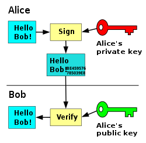

# Firma digital
> Firmad digital != firma electronica

Dato asociado a un mensaje digital que permite garantizar **autoría** e **integridad** de los documentos digitales.

No implica la **confidencialidad** del mensaje.

## Ley de firma digital
> ARTICULO 2º — **Firma Digital**. Se entiende por firma digital al resultado de aplicar a un documento digital un procedimiento matemático que requiere información de exclusivo conocimiento del firmante, encontrándose ésta bajo su absoluto control. La firma digital debe ser susceptible de verificación por terceras partes, tal que dicha verificación simultáneamente permita identificar al firmante y detectar cualquier alteración del documento digital posterior a su firma.
> 
> ARTICULO 3º — Del requerimiento de firma. Cuando la ley requiera una firma manuscrita, esa exigencia también queda satisfecha por una firma digital. Este principio es aplicable a los casos en que la ley establece la obligación de firmar o prescribe consecuencias para su ausencia.
> 
> ARTICULO 5º — **Firma electrónica**. Se entiende por firma electrónica al conjunto de datos electrónicos integrados, ligados o asociados de manera lógica a otros datos electrónicos, utilizado por el signatario como su medio de identificación, _que carezca de alguno de los requisitos legales para ser considerada firma digital_. En caso de ser desconocida la firma electrónica corresponde a quien la invoca acreditar su validez.
> 
> ARTICULO 13. — **Certificado digital**. Se entiende por certificado digital al documento digital firmado digitalmente por un certificador, que vincula los datos de verificación de firma a su titular.

- Se reconoce la eficacia jurídica de la firma electrónica
- **Firma electrónica:** esquema de encriptación asimétrica. No tiene valor probatorio: debe probarse que es válida (se presume que es inválida).
- **Firma digital:** firma electrónica reconocida por la justícia. Tiene valor probatorio: debe probarse que es inválida (se presume válida).

La Jefatura del gabinete de ministros es un ente licenciante, da **licencias** a **certificadores licenciados**, que tiene en un respositorio confiable las claves públicas. Presta servícios de firma digital, es como un *escribano digital*.

Estas **licencias** son:
  - Intransferibles
  - Requieren dictamen legal y técnico

**Obligaciones**
  - Mantener control exclusivo de la clave privada
  - solicitar revocación ante la duda de haber perdido el control
  - Informar cambios en la información del certificado

**Certificado digital**
  - Documento digital firmado digitalmente por un certificador, que vincula los datos de verificación de firma a su titular

**Excepciones**
  - testamentos
  - derecho de familia
  - actos personalísimos (donación de un órgano)