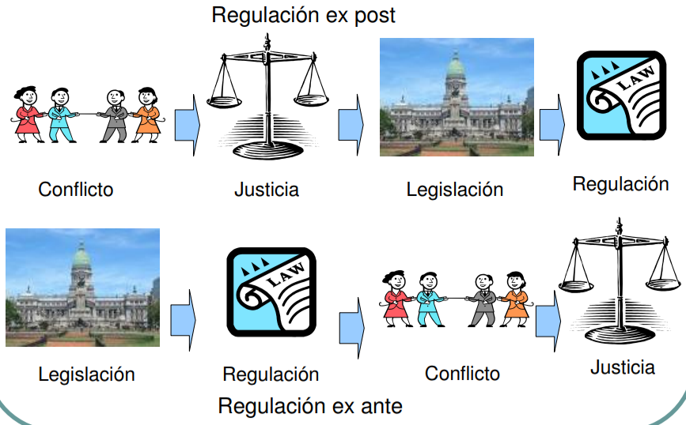
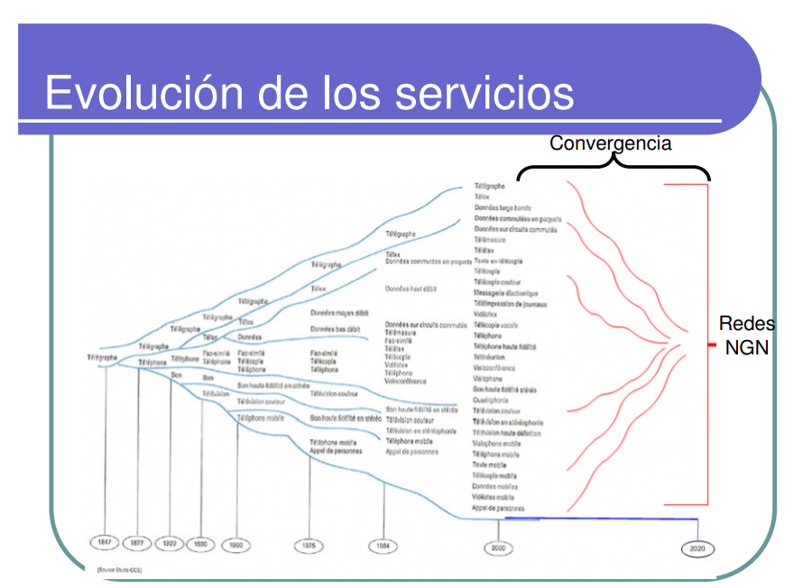
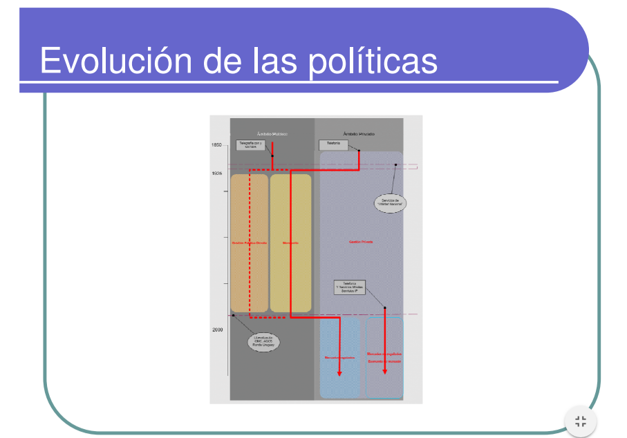

1. [Motivos para regular (SEC)](#motivos-para-regular-sec)
2. [Políticas regulatorias](#políticas-regulatorias)
3. [Jurisdicción](#jurisdicción)
4. [Entes reguladores y de control](#entes-reguladores-y-de-control)
5. [Tendencias históricas globales / necesidad de la reglamentación](#tendencias-históricas-globales--necesidad-de-la-reglamentación)
    1. [Historia de las telcos en Argentina](#historia-de-las-telcos-en-argentina)
6. [Ley nacional de telecomunicaciones (1972)](#ley-nacional-de-telecomunicaciones-1972)
    1. [Definiciones](#definiciones)
    2. [Otros temas que abarca la ley](#otros-temas-que-abarca-la-ley)
7. [Decreto 764/2000](#decreto-7642000)
    1. [Reglamento general de licencias](#reglamento-general-de-licencias)
    2. [Reglamento Nacional de Interconexión](#reglamento-nacional-de-interconexión)
        1. [Definiciones](#definiciones)
        2. [Lo que establece](#lo-que-establece)
    3. [Reglamento sobre administración, gestión y control del espectro radioeléctrico](#reglamento-sobre-administración-gestión-y-control-del-espectro-radioeléctrico)
        1. [Definiciones](#definiciones)
        2. [Lo que establece](#lo-que-establece)
        3. [Servidumbres administrativas de teleductos](#servidumbres-administrativas-de-teleductos)
    4. [Servicio Universal](#servicio-universal)
8. [Otras cosas](#otras-cosas)

# Telecomunicaciones
UIT: Unión internacional de telecomunicaciones

## Motivos para regular (SEC)
- **_Sociales:_**
  - Servicio universal (que las redes lleguen a lugares remotos / gente con menos plata / inclusión / gente con capacidades diferentes)
  - Privacidad
  - Confidencialidad
  - Seguridad
- **_Económicos:_**
  - por la existencia de recursos escasos (espectro, numeración, tendidos, órbitas geoestacionarias)
  - _explicación_: El objetivo de la Economía es estudiar la correcta distribución de los recursos escasos para satisfacer las necesidades del ser humano. En otras palabras, analiza la relación entre los recursos, que son de caracter limitado y las necesidades, que son de carácter ilimitado.
- **_Competitivas:_**
  - Proteger al consumidor, posibilidad de elegir
  - Aseguración del servicio
  - Aseguración de la propiedad privada
  - Competencia justa

## Políticas regulatorias

- Ex-post (legislo luego de conflicto o tecnología)
  - Legislo con experiencia, sé qué legislo
  - No hay seguridad jurídica entonces las empresas no invierten 
- Ex-ante (legislo antes de conflicto o tecnología)

La legislación puede contradecir / overridear a la jurisprudencia: por eso el tema de la seguridad jurídica.

## Jurisdicción
Las telecomunicaciones son reguladas federalmente.

Los municipios pueden reglamentar cuestiones como por ejemplo dónde pasar cables o no, o dónde poner antenas o no; como una mini pirámide jurídica.

## Entes reguladores y de control
- Regulador: arma normas
- De control: vela por el cumplimiento de las normas

Ventajas:
- Independencia estructural
- Independencia financiera
- Funcionalidad

## Tendencias históricas globales / necesidad de la reglamentación
Etapas:
1. **_Monopolio público:_** reglamentación limitada, ya que el Estado es el único operador y regulador.
2. **_Monopolio privado:_** más reglamentación, puesto que el operador privado necesita conocer sus derechos y obligaciones y el gobierno debe instaurar a través del regulador un marco de reglamentación para supervisar a los operadores.
3. **_Competencia parcial:_** mayor necesidad de reglamentación, toda vez que el regulador se ve obligado a diseñar herramientas para abordar el mercado liberalizado (por ejemplo, reglas sobre prácticas contrarias a la competencia, regimen de licencias, servicio universal y tarifación).
4. **_Competencia perfecta:_** más reglamentación limitada, ya que los mercados abiertos a la competencia se autorregulan, por lo cual se empieza a aplicar más reglamentación ex-post para establecer nuevos marcos jurídicos y de reglamentación que permiten abordar la convergencia y sus efectos específicos.

(mayor T: más regulación, nunca menos)

Objetivo último de la regulación: acrecentar el acceso a las TIC y proteger al consumidor (la competencia es un medio para esto)

Redes NGN: todo por el mismo cable (TV, voz, internet)

1850: Telegrafía era pública y telefonía privada
1925: telefonía y telegrafía monopolios públicos
Casi 2000: privatización general.

### Historia de las telcos en Argentina

Las redes de telegrafía iban al lado de las ferroviarias pq había infraestructura y pq eran las comunicaciones necesarias para operar el tren. topología red ferroviaria = topografía red de telégrafo. Topo radial alrededor de BA por razones económicas/exportaciones. Hoy en día las comunicaciones se distribuyen a lo largo de una medialuna central que va desde Buenos Aires a Chile, es decir, una línea en vez de un círculo, como es en todo el mundo.

- Primera etapa:
  - 1857: 1er telégrafo
  - 1875: ley 750,5 de telégrafos
  - 1904: se aplica esa ley a la telefonía (con una nueva ley)
  - 1936: ley de QoS: El Estado obliga un QoS mínimo a la empresa (monopolio privado de la telefonía)
- Segunda etapa:
  - 1946: Nacionalización
- Tercera:
  - 1972: Ley nacional de Telecomunicaciones: El contenido es parte de las comunicaciones (Gobierno de facto)
  - 1980: Ley de radiodifusión: el contenido no es parte de telecomunicaciones
- Cuarta: (?)
- Quinta:
  - 2000 reglamentos de:
    - Licencias
    - Interconexión
    - Administración y gestión del espectro
    - Servicio universal
  - Ley de medios / telecomunicaciones: renueva leyes viejísimas

## Ley nacional de telecomunicaciones (1972)
Es inescindible. No toca internet.

> Artículo 1º — Las telecomunicaciones en el territorio de la Nación Argentina y en los lugares sometidos a su jurisdicción, se regirán
> - por la presente ley,
> - por los convenios internacionales de los que el país sea parte y
> - por la reglamentación que en su consecuencia se dicte.

### Definiciones
- **Telecomunicación:** Toda transmisión, emisión o recepción de signos, señales, escritos, imágenes, sonidos o informaciones de cualquier naturaleza, por hilo, radioelectricidad, medios ópticos u otros sistemas electromagnéticos.
- **Radiocomunicación:** Toda telecomunicación transmitida por medio de las ondas radioeléctricas.
- **Telefonía:** Sistema de telecomunicación para la transmisión de la palabra o, en algunos casos, de otros sonidos.
- **Servicio de Radiodifusión:** Servicio de radiocomunicación cuyas emisiones se destinan a ser recibidas directamente por el público en general. Dicho servicio abarca emisiones sonoras, de televisión o de otro género.
- **Servicio telefónico:** Servicio que permite a sus usuarios comunicarse directa o temporalmente entre sí, por medio de aparatos telefónicos y circuitos de la red telefónica pública.

### Otros temas que abarca la ley
- Jurisdicción
- Competencia-Monopolio
- Uso Público
- Seguridad Nacional
- Privacidad
- Autoridad de Aplicación
- Confidencialidad
- Calidad de Servicio
- Licencias
- Interconexión
- Gestión del Espectro
- Guías telefónicas
- Infraestructura (Servidumbre de Teleducto?)
- Observaciones Judiciales (escuchas judiciales)

## Decreto 764/2000
Aprueba los Reglamentos:
- Régimen de Licencias.
- Reglamento Nacional de Interconexión (RNI)
- Reglamento de Gestión y Administración del Espectro Radioeléctrico
- Reglamento del Servicio Universal (SU)

Establece:
- **Autoridad de Aplicación**: Es la SECRETARIA DE COMUNICACIONES del MINISTERIO DE PLANIFICACION FEDERAL, INVERSION PUBLICA Y SERVICIOS. 
  - En algunos casos en forma conjunta con la Secretaría de Defensa de la Compentencia.
- **Autoridad de Control**: Es la COMISIÓN NACIONAL DE COMUNICACIONES, organismo actuante en la órbita de la SECRETARIA DE COMUNICACIONES

### Reglamento general de licencias
- Licencia única y general de telecomunicaciones
- Mínima obligación de inversión, por ocho meses, para telefonía local. Ninguna obligación para el resto de los servicios, incluyendo la larga distancia (LD).
- Libertad de precios para los nuevos prestadores y, en caso de competencia efectiva por área local (al menos el 20% de los ingresos del mercado en manos de otros operadores), también para los históricos.
- Se pueden revender las licencias. Establece un esquema de reventa sólo para propietarios de licencia, quienes serán los responsables del servicio.
- Los prestadores de radiodifusión podrán prestar licencia de telecomunicaciones
- Se exime de aportar tasa de control (0,5%) y servicio universal (1%) en aquellas áreas con teledensidad menor al 15%. La teledensidad se refiere al número de líneas telefónicas por habitante, así como al acceso per capita a televisores, faxes, computadoras, Internet, y otros medios de comunicación masiva que sirven como poderosos vehículos de información y conocimientos. 

### Reglamento Nacional de Interconexión
- Regula los Convenios de Interconexión entre los distintos prestadores.
- Regula el derecho de solicitar y la obligación de conceder interconexión

#### Definiciones
- **Convenio de interconexión:** acuerdo que celebran los prestadores para que sus clientes tengan acceso a servicios o usuarios del otro.
- **Interconexión:** Conexión entre prestadores
- **Prestador:** Licenciatario de servicios de telecomunicaciones.

#### Lo que establece
- Establece cargos de interconexión basados en CILP (costos incrementales de largo plazo) para facilidades esenciales y, para los restantes servicios de interconexión, en función del costo de prestación eficiente o de canasta referencial de precios (para prestadores con poder dominante y con poder significativo).
- Portabilidad numérica como derecho de los usuarios

### Reglamento sobre administración, gestión y control del espectro radioeléctrico

#### Definiciones
- **Asignación de frecuencias**: autorización que se otorga a una persona sobre una frecuencia o canal radioeléctrico.
- **Atribución de frecuencias**: Determinar para qué uso cada parte de la banda
- **Comprobación técnica de emisiones**: Comprobar que el autorizado cumple requerimientos técnicos y localizar fuentes de interferencias y estaciones radioeléctricas no autorizadas.

#### Lo que establece
- La demanda se satisface por:
  - Concurso o subasta cuando hya más de un interesado o se prevea escasez
  - A pedido
- Las autorizaciones son de carácter nacional excepto para servicios que lo justifiquen
- La autoridad de aplicación puede solicitar el cambio de frecuencias sin indemnización.

#### Servidumbres administrativas de teleductos

Se permite el uso del suelo exento de todo gravamen a fines de la prestación del servício.

Podrán utilizarse los bienes del dominio privado, nacional, provincial o municipal, sin compensación alguna, para el tendido o apoyo de instalaciones de los servicios públicos de telecomunicaciones siempre que se trate de simple restricción al dominio y no perjudique el uso o destino de los bienes afectados. 

### Servicio Universal

Es un conjunto de servicios y programas definidos por el Estado Nacional que establece calidad y precios accesibles para toda la población. Se podrán aplicar a todas las telecos.

Establece un Fondo Fiduciario del Servicio Universal.

## Otras cosas:
- Neutralidad de la red: (las redes son best effort) La priorización del tráfico por su contenido va en contra de la neutralidad.
