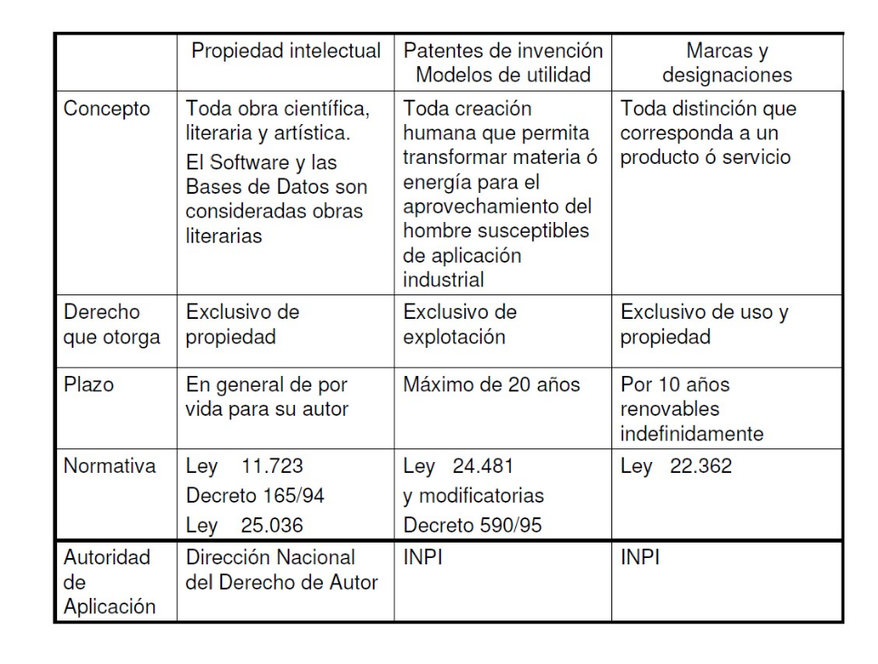

# Propiedad intelectual

## Resumen gral

- Decreto 165/94 => Modifica concepto de propiedad intelectual en cuanto a software 
- Ley 25036 => modifica y amplía normativa de propiedad intelectual (Ley 11723)
- INPI = Instituto Naciona de la Propiedad Intelectual

- La ley protege "Toda producción científica, literaria, artística o didáctica sea cual fuere el procedimiento de reproducción".
  - escritos de toda naturaleza y extensión, programas de computación fuente y objeto; compilaciones de datos o de otros materiales; 
  - obras dramáticas y/o musicales, 
  - cinematográficas, coreográficas y pantomímicas; 
  - obras de dibujo, pintura, escultura, arquitectura; 
  - modelos y obras de arte o ciencia aplicadas al comercio o a la industria; 
  - impresos, planos y mapas; 
  - los plásticos, fotografías, grabados y fonogramas
- La protección abarca la **expresión** de:
  - ideas
  - procedimientos
  - métodos de operación 
  - conceptos matemáticos 
  - **pero no esas ideas, procedimientos, métodos y conceptos en sí.**
- El derecho de propiedad comprende, para el autor, las facultades de: 
  - disponer de ella
  - publicarla
  - ejecutarla  
  - representarla
  - exponerla en público
  - enajenarla 
  - traducirla, adaptarla o de autorizar su traducción 
  - reproducirla en cualquier forma
- Para obras anónimas o pseudónimas: el editor tiene los derechos y las obligaciones del editor, una persona puede registrar el pseudónimo; adquiriendo así las obras.
- Titulares:
  - Autor
  - Herederos
  - Quienes traducen/adaptan/modifican la obra con permiso del autor (sólo tienen derecho sobre su versión)
  - El empleador de los desarrolladores en relación de dependencia
- Validez:
  - Autores: toda su vida
  - Herederos: 70 años luego de la muerte del autor
  - Colaboraciones: 70 años luego de la muerte del último
  - Obras póstumas: lo mismo que si las hubiera publicado
  - Herencia vacante: pasa a pertenecer al Estado, sin perjuicio de terceros.
  - Obras anónimas pertenecientes a personas jurídicas: 50 años desde su publicación.
  - Obras fotográficas: 20 años.
  - Obras cinematográficas: 50 años.
  - Cartas o fotografías de autores desaparecidos: 20 años.
- Los herederos no podrán oponerse a que  terceros:
  - reediten la obra luego de diez años sin publicarla
  - traduzcan las obras 10 años después de la muerte del autor
  - si en estos casos no hubiera acuerdo sobre las condiciones de impresión o la retribución pecuniaria, ambas serán fijadas por árbitros.
- No se pueden publicar copias no autorizadas
- Se pueden hacer copias de soft licenciado para salvaguardar el orginal
- Se pueden incluir hasta 1000 palbras u 8 compases en una crítica o comentario que tenga fines didácticos o científicos.
- Publicación parciales o periódicas: los plazos empiezan a valer al publicarse la última entrega
- **Obras extranjeras**:
  - Vale el menor plazo de entre el argentino y el extranjero
- **Colaboración:**
  - La propiedad no puede dividirse sin alterar la naturaleza de a obra
  - Salvo convenios especiales, los colaboradores de una obra tienen derechos iguales.
- No se pueden publicar discursos de ningún tipo si el autor no lo autorizó (excepto para periodismo)
- Los artículos no firmados en una publicación periódica/radio/revista serán considerados de propiedad del medio que lo publicó.
- Los firmados son propiedad de el/los autores aunque sean colaboraciones
- No podés publicar una imagen de una persona sin permiso de ella (o sus parientes si murió), salvo para fines científicos o culturales, o hechos en público.
- **Contrato de edición:**
  - Titular de derecho de propiedad: autoriza al editor, o puede cederle los derechos
  - Editor: se compromete a reproducir, evnder y difundir la obra
- **Transferencia del derecho**
  - La validez sigue siendo por el plazo que indica la ley
  - El autor conserva el derecho a exigir fidelidad de su título y texto y la mención de su nombre 
  - Debe registrarse en el Registro Nacional de la Propiedad Intelectual

- Se entiende por software: Diagramas, código fuente y objeto, documentación para usuarios y desarrolladores.
- Se entiende por base de datos: organizaciones de datos interrelacionados cuyo objetivo es servir a un sistema ​ i ​ nformático en el almacenamiento y recuperación de información
  - Puede registrarse con una muestra grande y la definición del esquema
- Se considera publicado un soft cuando se pone a disposición mediante copias o medios de transmisión.
  

